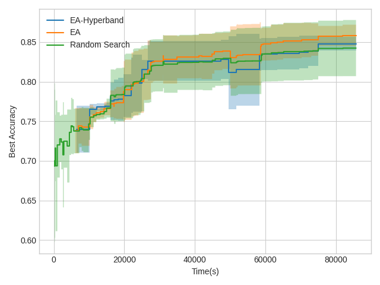

# AutoML lecture 2021 (Freiburg & Hannover)

My approach for optimizing a network accuracy with constraints has been an Evolutionary
Algorithm with Hyperband, which focuses on keeping a population that satisfy the constraints to then
optimize the accuracy. If a configuration with the specified constraints 
    is not satisfied the algorithm returns the one with the best found precision.

## How to run the optimizer
The chosen implementation has been a variation of an Evolutionary Algorithm with Hyperband which supports constraints.
By adding Hyperband, bad configurations are cut off early.
This script should be called as following to match the reported results on the slides (min precision is 0.39 and max number of parameters is 2e7):

`$ python AutoML.py --pop_size 50 --num_children 10 --hyperband True`

It also admits the `--constraint_max_model_size` and `--constraint_min_precision` parameters to try harder constraints.
   
When not using the hyperband parameter, it will just perform a regular evolutionary strategy.

It is recommended to set the `--max_time` parameter to 82800 (23 hours) to avoid run for more than 24 hours since
the algorithm only checks the time at the end of a step.

After passing max_time, it will output 4 files:
* automl_run_{moreInfo}.json   includes all the fully evaluated configurations
* opt_cfg_{moreInfo}.json   includes the optimal found configuration that can be evaluated in main.py
* {moreInfo}.csv   information about how the algorithm evolves over time for visualization purposes

During the run, it will also create a {moreInfo} folder that stores the weights of the partially trained algorithm
to avoid high GPU consumption when doing hyperband.

The file [AutoML_random_search.py](src/AutoML_random_search.py) works in the same way but it computes a
Random Search. This has been made for comparison purposes.

### Additional added python scripts
* [EA.py](src/EA.py)  
Evolutionary Algorithm strategy for optimizing a CNN. It can be run with hyperband.
* [member.py](src/member.py) 
Class that handles an individual of the Evolutionary Algorithm population.
* [evaluation.py](src/evaluation.py) 
Script to display plots and evaluate a batch of optimal configurations. This script has been used
to report the results of the optimizer.
* [target.py](src/target.py)  
Target function. Is a handle of the CNN.
* [utils.py](src/utils.py) 
Contains helpers for the different scripts.

## How to evaluate the optimal found solution
Once the optimizer has been run, it will output a file with the optimal configuration, which has the name of
**opt_cfg_{moreInfo}**, where **moreInfo** indicates some information about the hyperparameters of how the algorithm
has been run. This more info includes the random seed which can be passed as a parameter in --seed to obtain
comparable results.

This file should be passed as the **--configuration** parameter to [main.py](src/main.py) to be evaluated

In this case, the best configuration obtained for the EA-Hyperband would be run with the following command:

`$ python main.py -c runs/opt_cfg_popSize_50_numChildren_10_hyperband_True_minPrecision_0.39_seed_123_date_2021_09_02-04:36:25_PM.json -t True`

## Configurations successfully tested
Here there is an information table with the configurations tested and evaluated by running the algorithm 23-24 hours.
All these configurations have been run with the 123 seed, for a different seed check the same file name in the same folder
but with a different seed number. The models have been evaluated with the [main.py](src/main.py) script. These results are
for the EA-Hyperband algorithm. For just the EA without hyperband and the Random Search algorithms reported in the
slides please check the folder and their respective file names.

| Config | constraint_min_precision | constraint_max_model_size | Configuration Parameters | Test Precision | Test Accuracy
| :---: | :---: | :---: | :---: | :---: | :---: |
| [config 1](src/runs_precision/opt_cfg_popSize_50_numChildren_10_hyperband_True_minPrecision_0.39_seed_123_date_2021_09_02-04:36:25_PM.json)  | 0.39 | 2e7 | 1012899 | 0.560 | 0.903 |
| [config 2](src/runs_params/opt_cfg_popSize_50_numChildren_10_hyperband_True_minPrecision_0.39_maxModelSize_50000000_seed_123_date_2021_09_07-09:22:20_AM.json)  | 0.39 | 5e7 | 12322877 | 0.573 | 0.906 |
| [config 3](src/runs_params/opt_cfg_popSize_50_numChildren_10_hyperband_True_minPrecision_0.39_maxModelSize_100000000_seed_123_date_2021_09_07-09:22:42_AM.json)  | 0.39 | 1e8 | 12322877 | 0.575 | 0.915 |
| [config 4](src/runs_precision/opt_cfg_popSize_50_numChildren_10_hyperband_True_minPrecision_0.4_maxModelSize_20000000.0_seed_123_date_2021_09_07-09:20:39_AM.json)  | 0.40 | 2e7 | 2251076 | 0.556 | 0.924 |
| [config 5](src/runs_precision/opt_cfg_popSize_50_numChildren_10_hyperband_True_minPrecision_0.42_seed_123_date_2021_09_06-09:44:23_AM.json)  | 0.42 | 2e7 | 1897658 | 0.566 | 0.921 |
| [config 6](src/runs_params/opt_cfg_popSize_50_numChildren_10_hyperband_True_minPrecision_0.39_maxModelSize_4000000_seed_123_date_2021_09_09-10:16:52_AM.json)  | 0.39 | 4e6 | 2021579 | 0.568 | 0.891 |
| [config 7](src/runs_params/opt_cfg_popSize_50_numChildren_10_hyperband_True_minPrecision_0.39_maxModelSize_2000000_seed_123_date_2021_09_09-10:17:51_AM.json)  | 0.39 | 2e6 | 871034 | 0.492 | 0.900 |

## Hardware where the code has been tested and reproducibility
The code has been run with **Python 3.6.8** in the Pool Computers. 
The Pool Computers have an Intel(R) Core™ i7-3770 CPU @ 3.40GHz and an Nvidia GeForce GTX 1060 3GB.

The packages needed as well as their versions are indicated in [requeriments.txt](requirements.txt). However,
note the following CUDA 9.2 version:
`torch                         1.4.0+cu92`
`torchsummary                  1.5.1`
`torchvision                   0.5.0+cu92`

## Final Project

This repository contains all things needed for the final project.
Your task is to optimize a network's accuracy (maximize) with the following constraints: network size (upper bound) and precision (lower bound),
such that your network reaches a maximal accuracy under the given constraints.
The constraint values that we provide in the scipt are only an example. We will reevaluate your algorithms with different constraints after your submission. That is, you cannot 
simply satisfy the model size constraint with a specially designed configuration space.

## Repo structure
* [micro17flower](micro17flower)  
  contains a downsampled version of a [flower classification dataset](http://www.robots.ox.ac.uk/~vgg/data/flowers/17/index.html).
  We cropped ans resized it such that the resulting images are of size 16x16. You are only allowed to run your optimizer with the data in [train](micro17flower/train)

* [src](src) Source folder      
    * [bohb.py](src/bohb.py)  
      contains a simple example of how to use BOHB in SMAC on the dataset. This implementation does not consider any constraint!
    
    * [cnn.py](src/cnn.py) 
      contains the source code of the network you need to optimize. It optimizes the top-3 accuracy.
    
    * [main.py](src/main.py) 
      contains an example script that shows you how to instantiate the network and how to evaluate the metrics required in this project. This file also gives you the **default configuration** that always has to be in your search space.

    * [AutoML.py](src/AutoML.py)  
      You will implement your own optimizers under this script. It should at least be able to receive the constraint values (network size and precision) and 
      store the optimal configuration to "opt_cfg.json"
    
    * [utils.py](src/utils.py) 
      contains simple helper functions for cnn.py
